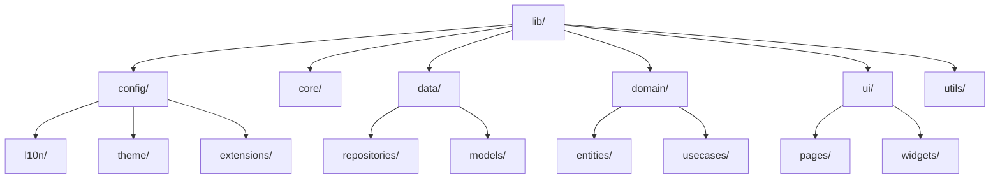

# 
NetWise Pro - Wireless Network Management System 📡

  
 
  
---- 

  <td></td>
  <td></td>
  <td></td>

---

## Overview

NetWise Pro is a modern Flutter-based application for managing and monitoring wireless networks. It empowers users and administrators with robust tools for network operations, analytics, and security. The app features a clean, responsive UI and supports multiple languages for a global audience.

---

## Description

- Manage, monitor, and analyze wireless networks with ease.
- Secure, multi-language, and responsive for all devices.
- Designed for both network admins and everyday users.

---

## What Does This App Do? (Step-by-Step)

1. **User Authentication:** Secure login and session management.
2. **Network Management:** Add, edit, and delete network details, cards, packages, and offers.
3. **Sales & Reports:** Sell balances, view sales, and generate detailed reports.
4. **Notifications:** Receive real-time updates and alerts.
5. **Settings:** Customize preferences, themes, and language.

---

## Technology Stack

<table>
  <tr>
    <td align="center" width="96">
      
       Flutter
    </td>
    <td align="center" width="96">
      
       Dart
    </td>
    <td align="center" width="96">
      
       MongoDB
    </td>
    <td align="center" width="96">
      
       Node.js
    </td>
    <td align="center" width="96">
      
       Redis
    </td>
    <td align="center" width="96">
      
       JWT
    </td>
    <td align="center" width="96">
      
       REST API
    </td>
    <td align="center" width="96">
      
       Postman
    </td>
  </tr>
</table>

---

## Key Features

- Add, edit, and manage network details, cards, and packages
- Multi-language support (English, Arabic)
- Responsive UI (Sizer)
- Dark/Light theme
- Custom animations and transitions
- Secure authentication and permission management
- Comprehensive reporting and analytics
- Real-time notifications

---

## Core Technical Features

- **State Management:** Provider
- **Localization:** flutter_localizations, intl
- **Network Requests:** http
- **Data Storage:** shared_preferences
- **Animations:** lottie, custom transitions
- **Charts & Visualization:** syncfusion_flutter_charts
- **Functional Programming:** dartz
- **SVG & Media:** flutter_svg, image_picker, file_picker

---

## Development Skills Applied

- Clean architecture and modular codebase
- Advanced Flutter UI/UX design
- State management with Provider
- RESTful API integration
- Secure local storage and permission handling
- Responsive and adaptive layouts
- Internationalization (i18n)

---

## Mobile Development

- Built with Flutter for cross-platform (Android & iOS)
- Uses Sizer for responsive design
- Supports both light and dark themes
- Optimized for performance and smooth animations

---

## Tools & Methodologies

| Tool/Methodology         | Purpose                        |
|-------------------------|--------------------------------|
| Flutter                 | Cross-platform development     |
| Dart                    | Programming language           |
| Provider                | State management               |
| REST API                | Backend communication          |
| Postman                 | API testing                    |
| Git                     | Version control                |
| VS Code/Android Studio  | Development environment        |
| JWT                     | Authentication                 |
| MongoDB/Redis           | Backend data & cache           |

---

## Application Structure

---

## Screen Architecture

- **Authentication Screens:** Login, Registration, Forgot Password, Verification
- **Home Screen:** Dashboard, quick stats, navigation
- **Menu:** Profile, Settings, Account Switch, About, Logout
- **Network Management:** Edit network, manage coverage, offers, engineers
- **Reports:** Sales, exports, imports, analytics
- **Notifications:** Real-time updates, filterable by type

---

## 📦 Packages Used

| Package                   | Purpose                        |
|---------------------------|--------------------------------|
| provider                  | State management               |
| sizer                     | Responsive UI                  |
| dartz                     | Functional programming         |
| http                      | Network requests               |
| flutter_svg               | SVG rendering                  |
| lottie                    | Animation support              |
| syncfusion_flutter_charts | Data visualization             |
| intl                      | Internationalization           |
| image_picker              | Image selection                |
| file_picker               | File selection                 |
| awesome_dialog            | Custom dialogs                 |
| fluttertoast              | Toast notifications            |
| path_provider             | File system access             |
| permission_handler        | Permissions                    |
| skeletons                 | Loading skeletons              |
| animations                | Custom animations              |
| flutter_native_splash     | Splash screen                  |

---

  <b>Made with ❤️ using Flutter</b>

 
